# Notes de stage

remarque: le markdown s'affiche un peu mal parfois sur github, surtout l'intégration latex.

## Le Blob

Organisme unicellulaire, physarum polycephalum capable de résoudre un certain nombre de problèmes etc 
Plus d'infos sur le docu arte, sur le site du cnrs et sur misterblob par ex

quelques problèmes qu'il est capable de résoudre
 
### Réseaux de transport

Source: https://www.youtube.com/82hXb0eS52Y?si=7A5NjTLrjXF2jxoy

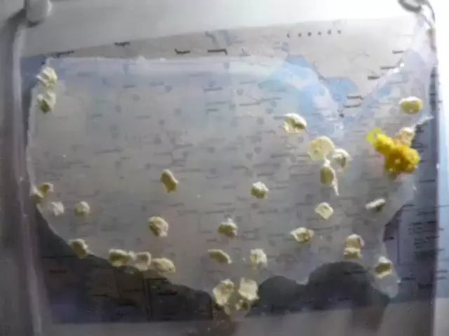

### Labyrinthe

Source: https://www.youtube.com/75k8sqh5tfQ?si=HtxPUKZNmFYGeENg

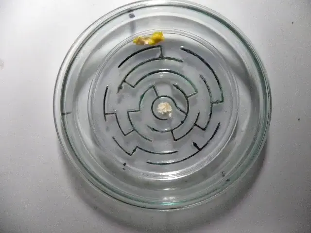

## JS-Sandpile

Il s'agit d'un logiciel permettant d'utiliser des modèles de piles de sable. Il permet d'utiliser différents types de pavages. Il a été programmé par Kévin.

L'idéal serait de pouvoir concevoir un modèle d'automates cellulaire spour les blobs. On pourrait avoir un certain nombre d'états correspondant à la "quantité" de blobs présente dans un endroit particulier. Et on pourrait avoir un état dénotant la présence de nourriture.

Modification de la classe Tiling pour introduire des règles d'évolution, définies dans `js/Evolution`. Les classes implémentent une fonction `iterate(tile, neighbors)`. Si le this.is_global est à true, elles implementent `global_iteration(tiles)` (pour avoir des règles pas locales)
## Lectures

### Road planning with slime mould: if Physarum built motorways it would route M6/M74 through Newcastle

Un modèle computationnel a déjà été défini dans l'article de Jones J de 2008.

L'idée de l'expérience est de simuler les grands espaces urbains des UK, et de laisser le blob créer un nouveau réseau.

Ils mettent un lien vers une [page](https://web.archive.org/web/20150124012721/http://uncomp.uwe.ac.uk:80/jeff/urban/urban.htm) contenant une [vidéo](https://www.youtube.com/watch?v=BbOlAqVWu5c) qui n'est plus disponible.

### The emergence and dynamical evolution of complex transport networks from simple low-level behaviours

Le papier prétend présenter une approche *bottom-up* plutôt que *top-down*: on essaie de construire un modèle à partir d'observations microscopiques locales, ainsi que leurs intéractions avec l'environnement plutôt que des phénomènes globaux. 

Leur modèle est programmé "manuellement" et non pas avec un automate. Ils semblent définir toute une notion d'angle, de direction. Le blob avance dans une directions et change de comportement selon le contenu de ses deux sensors. J'ai interrompu ma lecture.

pas lu entièrement, mais réétudié plus tard


### Minimal model of a cell connecting amoebic motion and adaptive transport networks

#### Introduction

*Physarum* peut résoudre un labyrinthe, un problème d'arbre couvrant, une opération logique. Il peut également supprimer des chemins redondants.

L'idée est de concevoir un modèle de proto-cellule à partir d'automates cellulaires : une **cellule** étant une forme de vie délimitée par une 
**membrane**.

CELL se base sur l'idée d'**alleger la membrane** pour permettre au cytoplasme de s'étendre là où elle s'allège, et produire des déplacements dynamiques. En choisissant les lieux où la membrane s'allège avec une certaine logique on peut simuler le type de déplacement du blob.

#### Définition du modèle

La base du modèle repose sur ces faits :

1. **cellule** = cytoplasme entouré par une membrane
2. **membrane** = bord de la cellule, où la membrane durcit
3. lorsque la membrane ramollit, le reste du cytoplasme **rejoint la partie ramollie**
4. lorsque le cytoplasme se déplace, il **transporte la membrane**

Le modèle CELL a globalement trois états principaux, l'**intérieur** ($S_1$), la **membrane** ($S_2$) et l'**extérieur** ($S_0$).

Le modèle a deux phases : celle de **dévelopement** et celle d'**exploration**. Pendant la phase de développement, le CELL s'étend en forme de diamant jusqu'à atteindre sa talile maximale $m$. Pendant la phase d'exploration, on choisit des lieux de formations de *bulles*, qui sont les lieux où la membrane s'allège. On transportre ensuite la bulle de sorte à reboucher le trou formé.

Je pense que le mieux à faire est de se baser sur ce modèle plutôt que le suivant (+ parcimonieux). Il y a seulement un aspect arbitraire dans la construction du modèle qui est le choix même des lieux sur lesquels ont lieu les échanges. Pour mieux simuler le comportement du uvrai blob il faudrait peut être choisir les lieux les plus proches des *sources de nourriture* (qui ne sont même pas considérées ici).

Il se trouve qu'en fait ce modèle correspond exactement à VP...


##### Phase de développement

On construit initialement  un aggrégat de composants de cellules (cytoplasme entouré d'une membrane). Pour l'instant, je considère que l'état $S_1$ se divise en réalité en plusieurs états $S_{1_1} \ldots S_{1_m}$. Le vrai état $S_1$ est atteint lorsque $S_{1_k} = S_{1_m}$.

On note $S(i, j, t)$ l'état de la cellule en position $(i,j)$ à la date $t$. On peut également noter cela $S(p,t)$ où $p=(i,j)$. On note $N(i,j)$ l'ensemble des voisins de $(i,j)$. On note $C(i,j,t,S)$ le nombre de voisins de $(i,j)$ ayant l'état $S$ à la date $t$. On a donc, avec les notations précédentes: $$C(i,j,t,S) = \text{Card}(\{p \in N(i,j) \mid  S(p,t) = S\})$$

Les règles d'évolutions sont les suivantes. 

$$S(i,j,t+1) = \begin{cases} S_{1_{k+1}} \quad \quad  \text{ si } \exists k < m : C(i,j,t,S_{1_k}) > 0 \\ S_{1_{k+1}} \quad \quad \text{ si } S(i,j,t) = S_{1_{k}} \text{ avec } k < m \\ S_1 \quad \quad \quad \text{ si } S(i,j,t) = S_{1_m} \text{ et } C(i,j,t, S_{1_m})=4 \\ S_2 \quad \quad \quad \text{ si } S(i,j,t) = S_{1_m} \text{ et } C(i,j,t,S_{1_m}) < 4 \\ S(i,j,t) \quad \text{sinon} \end{cases}$$

Dans le premier cas, on choisit (même si on devrait pas avoir de choix à faire normalement) le $k$ maximal.

Lorsqu'on atteint une situation stable on débute la phase d'exploration. Dans ce cas là, on se retrouve avec du cytoplasme ($S_1$) entouré de membrane ($S_2$), évoluant dans une mare d'*extérieur* ($S_0$).

##### Phase d'exploration

Une fois construit, le CELL peut manger le $S_0$, et envahir l'extérieur. Cela correspond à la propriété 3. Le $S_0$ se fait transporter par la membrane à l'intérieur du CELL (l'état $S_2$). 

On introduit deux états temporaires $S_3$ (bulle) et $S_4$ (marqué).

En gros, l'idée est d'échanger le bord avec du vide, et de boucher le trou ainsi formé à l'intérieur du CELL, sans repasser par les cases déjà visitées. De cette façon on peut simuler un déplacement / extension.

Par contre, il est nécessaire d'introduire un espèce de nouvel axe temporel, qu'on va noter $k$ (c'est l'axe d'un *cycle*). Toutes les définitions précédentes font lieu, en introduisant en subscript un petit $t$ (genre $S_t(i,j,k)$). On fait des modifications jusqu'à atteindre $S_t(i,j,k_{max})$. 

Les règles d'évolution suivant l'axe $k$ sont pour la plupart un peu trop complexes pour les résumer en une seule liste de cas. Par contre on peut définir les états initiaux assez facilement.

En début de cycle, on **choisit** un *stimulus point* $sp$, un point en état $S_2$ pour se faire envahir. C'est là que la *bulle* se trouvera.

Les états initiaux se définissent de cette façon.

$$ S_t(i,j,0) = \begin{cases} S_3 \quad \text{ si } (i,j) = sp \\ S_2 \quad \text{ si } (i,j) \in N(sp) \text{ et } S(i,j,t)=S_0 \quad * \\ S_2 \quad \text{ si } S(i,j,t) = S_1 \\ S_0 \quad \text{ sinon }\end{cases}$$

Petit *catch*: la deuxième règle ne s'applique qu'une seule fois (pour un seul voisin du $sp$).

On a ensuite les règles suivantes:

$$S_t(i,j,k+1) = \begin{cases}  S_4 \quad \text{ si } S_t(i,j,k) = S_3 \\ S_3 \quad \text{ si } S_t(i,j,k) = S_2 \text{ et } C_t(i,j,k,S_3) > 0 \quad *\\ S_t(i,j,k) \text{ sinon }\end{cases}$$

Premier *catch*: la deuxième règle est appliquée qu'une seule fois. C'est à dire qu'on a toujours qu'une seule case dans l'état $S_3$ à la fois (pas tous les voisins du $S_3$ se transforment quoi). Cela signifie qu'il y a un **choix** à effectuer parmi les voisins de la bulle.

Deuxième *catch*: en fait c'est pas un catch mais c'est pas grave, on peut décider d'arrêter plus tôt le cycle si on ne peut plus transférer la bulle, même si on a pas encore atteint $k_{max}$.

Troisième *catch*: si $C_t(sp,k, 0) = s$, on considère également que $k$ a atteint $k_{max}$ et on applique plus aucune règle.

Il faut maintenant définir les états finaux.

$$ S(i,j,t+1) = \begin{cases} S_1 \quad \text{ si } C_t(i,j,k,S_4)+C_t(i,j,k,S_2) = 4 \text{ et } S_t(i,j,k) \in \{ S_2, S_4 \} \\ S_2 \quad \text{ si } C_t(i,j,k,S_4)+C_t(i,j,k,S_2) < 4 \text{ et } S_t(i,j,k) \in \{S_2, S_4\} \\ S_0 \quad \text{ sinon} \end{cases}$$

Tout va se jouer sur le choix des lieux de formation des $sp$.

###### Aspects problématiques

Il y a trois moments où on doit effectuer un **choix**. Pour les deux règles marquées d'une étoile c'est pas forcément très problématique, on effectue un choix sur le voisinage immédiat d'une cellule, on reste borné mais on perd seulement le déterminisme. En soit, c'est pas tellement grave.

Par contre, pour le choix du stimulus point ça cause deux problèmes :
- D'abord, ça peut causer des mouvements **incohérents**. Le choix du stimulus permet de définir une direction vers lequel le blob se "dirige". Le problème dans tout ça est que s'il n'y a aucune consistance dans les choix, le blob prend aucune direction et se contente de se déformer.
- De deux, on perd fortement du **déterminisme**. On effectue un choix absolument pas local (c'est seulement "local" sur un voisinage énorme (la taille du blob) donc c'est pas ouf).

=> On peut plutôt partir sur une heuristique basée sur la distance à la nourriture. Ça règle le premier problème mais pas le second malheureusement. On pourrait même arguer que c'est pire au niveau du second problème.

###### Heuristique nourriture

On introduit la fonction $D$, de distance euclidienne entre deux points. (on pourrait également utiliser la distance de Manhattan, je sais pas ce qui esrait le plus cohérent).

(ça a un réel impact)
(0,5)|(1,3) vs (7,7)
distance manhattan 9|10
distance eucl (au carré) 53|52

On pose $F(t) = \{ (i,j) \mid S(i,j,t) = S_5 \}$. Et on introduit la distance minimale à la nourriture notée $DFS(i,j,t)$. On a donc
\[DF(i,j,t) = \min_{x \in F(t)} D((i,j), x) \]

Le but est de choisir le point de formation de la bulle en fonction de la distance minimale qu'on a à la nourriture. En gros, on essaie de former des bulles sur les points les plus proches (distances les moins élevées) de la nourriture. Mais, il faut se restreindre aux points qui se trouvent sur la membrane. On pose donc $Memb(t) = \{ (i,j) \mid S(i,j,t)=S_2 \}$ pour dénoter la membrane. 

Pour un point $(x,y)$ de $Memb(t)$, la probabilité qu'on forme une bulle est donc 
\[\frac{1}{DF(x,y,t)DFT(t)}\]


où $DFT(t)$ sert à normaliser pour bien obtenir une fonction de probabilité (i.e.  $DFT(t) = \displaystyle{\sum_{p \in Memb(t)} \frac 1 {DF(p,t)}}$).

On considère l'inverse pour que ce soit *inverse*ment proportionnel à la distance. Le truc c'est qu'on pourrait ajouter un carré ou qq chose du genre.

(peut etre une heuristique un peu forcée ??)

On pourrait imaginer une nouvelle règle qui transforme la nourriture et l'intègre dans la membrane.

Normalement ça devrait forcer le blob à se diriger vers les lieux où se trouvent la nourriture. Le souci c'est que ça risque de casser la capacité de résolution de labyrinthe.

##### Fonctionnement

Il semblerait que le comportement du CELL soit à peu près entièrement déterminé par les choix de zones actives. Selon les points choisis, on peut obtenir des capacités computationnelles différentes.

Finalement tout ça marche plutôt bien mais on a pas vraiment un CA

### An adaptive and robust biological network based on the vacant-particle transportation model

#### Différents modèles

On introduit différents types de modèles :

##### Modèle "vacant particle" (VP)

On transporte de façon asynchrone une *vacant particle*. Le blob est composé d'un agrégat de cellules, dont le nombre ne varie pas. 

##### Modèle retrécissement (VP-S)

Similaire au premier, mais on fait diminuer le nombre de cellules dans l'agrégat, pour concentrer le cytoplasme dans les sources de nourriture.

##### Modèle development (VP-D)

Similaire au second mais on agrandit au lieu de décroitre. Simule le dévelopment du blob.

#### Description des modèles (de leur comportement)


##### VP

Une case peut soit être en état **libre** (0), soit être du **sol** (1), soit du **gel** (2), soit une vacant particle (-1). Le déplacement de l'organisme se fait par la transportation de la vacant particle.

Le temps évolue selon deux composantes, t, et s. t est l'évolution du temps à proprement parler, s une sorte de step.

Au step initial, on trouve aléatoirement une case libre au bord du blob. Cette case devient une vacant particle, et toutes les autres cases restent les mêmes.

La vacant particle se déplace dans le blob, en remplaçant le sol disponible par elle, et en se transformant en gel. Les autres ne changent pas. On repète ceci jusqu'à ce qu'on ait fait suffisamment de steps, où que la vacant particle n'est entourée que de cases libres.

A la fin, le gel devient sol, le sol reste sol, le libre reste libre et la vacant particle devient libre. Et on passe au temps suivant.

Pour les autres modèles, c'est légèrement différent.

### Physarum Machines (Adamatzky)

met l'accent sur le lien entre le comportement du Blob et les modèles de réaction-diffusion. 
présente certaines expériences computationnelles sur le blob (portes logiques, labyrinthes, réseaux etc)

### Advances in Physarum Machines

#### Modèle multi-agent basée sur un système de réaction diffusion

Décrit dans le livre de Jeff Jones mais également dans Advances in Physarum machines

notes en vrac, juste pour pas perdre le fil

following possible grain levels for Physarum: atomic-molecular-chemical-actomyosin-plasmalemma-plasmodium

on vire atomic-*chemical

apparemment le couplage et le flux dans le gel/sol ?? permet d'expliqeur le comportement complexe

gel: sponge-like matrix
sol: protoplasmic solution qui défile

le réseau: positions des particules
flow de sol: mouvement des particules

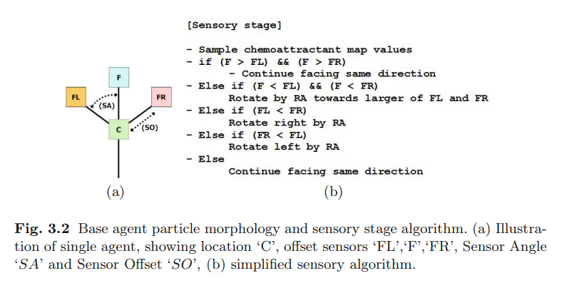
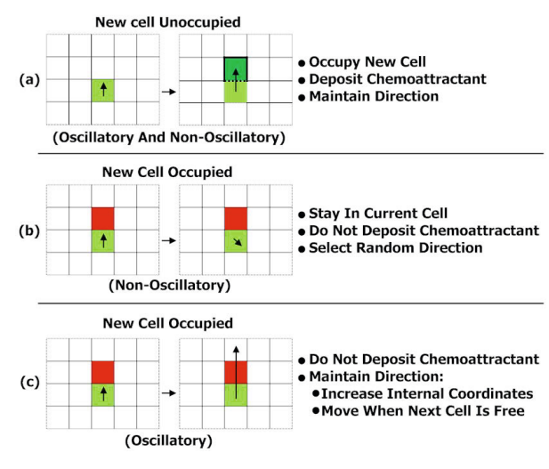

problème dans les règles décrites ici est qu'on a une notion de "déplacmeent" et c'est pas tellement ce qu'on veut.

On peut regarder depuis les cases vides qui se trouvent autour d'une case C, les voisins de C pour pouvoir effectuer le m^$eme calcul mais d'un autre pdv. on perd pas l'aspect local


des chemins
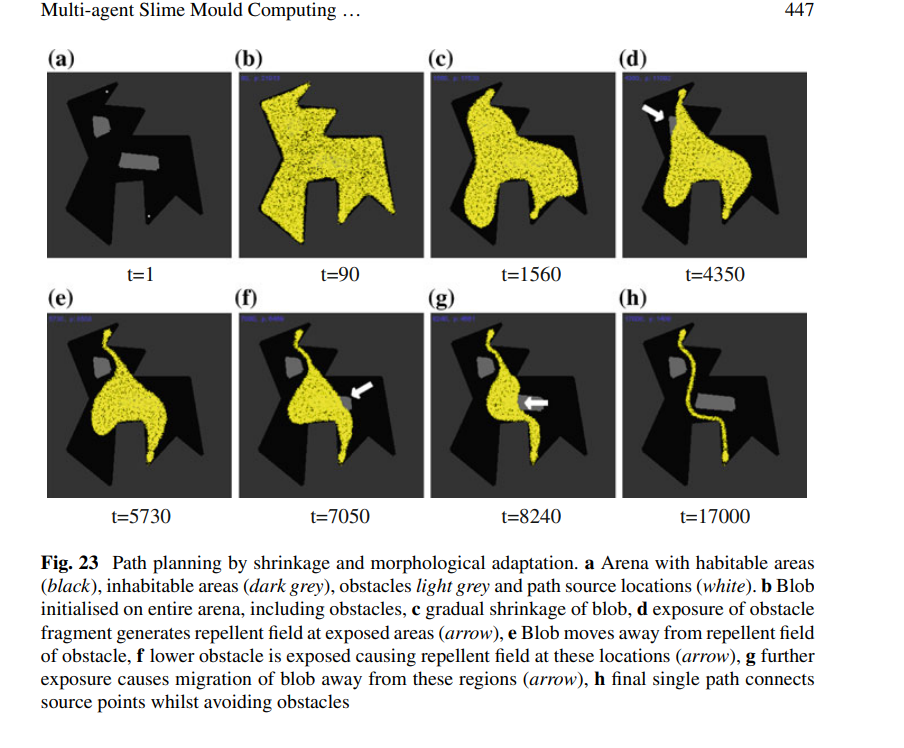

la taille du blob varie selon une  part d'aléatoire en fonction des dynamiques de sur/sous-population

Globalement, il semblerait qu'on considère des "agents" qui se déplacent en emettant du chimioattracteur (pour la nourriture et pour le blob lui meme), et selon l'intéraction qu'il y a entre les chimioattracteurs, on peut faire apparaître des comportement cmoplexes. On peut par exemple se diriger vers les endroits ou l'attractuers est le plus fort etc

Tous les aspects de rotation etc sont un peu forçables, mais pas très satisfaisants.

Comportement différent en condition de faim (peu de nourriture) vs beaucoup. (exploration vs exploitation)

fin du calcul = configuration stable

Analogie espace <-> donnée. On représente les configurations par des répulsifs/attractifs.

On sait


#### Modèle basé sur des équations

de Tsompanas et Sirakoulis, présent dans *Cellular Automata Models Simulating Slime Mould Computing* dans AIPM.

Ce modèle est un peu différent. Il est qualifié de CA par les auteurs mais n'en est pas entièrement un (pas très grave, possibnle de le transformer)

NS=Nutrient Sources=nourriture
SP=Starting Point

On considère que l'état d'une case est définie par les composantes suivantes:
- $AA$: flag booléen désignant si la case est libre
- $PM$: pour physarum mass, quantité de blob, à $100$ pour le point initial, $0$ sinon
- $CHA$: Chimioattracteur, à $100$ initialement pour les sources de nourritures
- $TE$: flag désignant si la case fait parti d'un *tube* (aspect problématique)
- $PA_{(i,j),(i-1,j)}$: Physarum attraction, pour chaque direction vaut soit $PAP$ soit $-PAP$ selon si la direction directe ou opposés est la chemical attraction maximale, et 0 pour les autres

Les deux équations peuvent se rétra

Globalement, l'évolution se fait sur deux régimes, pendantle premier, le chimioattracteur et le blob se diffusent selon des équation discrètes (que je recopie pas)

On peut en fait les retraduire

\[
PM_{t+1}(i,j) = PM_t(i,j) + PMP_1 \times \sum_{v \in \text{VonNeumann}(i,j) }(1+PA_t(v))PM_t(v) - PMP_3 \times PM_t(i,j) + PMP_2 \times \sum_{v \in \text{Diag}(i,j) }(1+PA_t(v))PM_t(v) - PMP_3 \times PM_t(i,j) 
\]

et 

\[
CHA_{t+1}(i,j) = CON \times \left( CHA_t(i,j)+CAP_1\sum_{v \in \text{VonNeumann(i,j)} } CHA_t(v)-CAP_3 \times CHA_t(i,j) + CAP_2 \sum_{v \in \text{Diag(i,j)} } CHA_t(v)-CAP_3 \times CHA_t(i,j)\right)\]

un peu une sorte de dérivée discrète, en effet en pratique on met $PMP_3=CAP_3=CON=1$

\[
PM_{t+1}(i,j) = PM_t(i,j) + PMP_1 \times \sum_{v \in \text{VonNeumann}(i,j) }(1+PA_t(v))PM_t(v) - PM_t(i,j) + PMP_2 \times \sum_{v \in \text{Diag}(i,j) }(1+PA_t(v))PM_t(v) - PM_t(i,j) \\
CHA_{t+1}(i,j) = CHA_t(i,j) + CAP_1\sum_{v \in \text{VonNeumann}(i,j) } CHA_t(v)-CHA_t(i,j) + CAP_2 \sum_{v \in \text{Diag(i,j)} } CHA_t(v)-CHA_t(i,j)\]

On exclut de la somme les termes correspondant à des murs (c'est pas dit dans le papier bouhh)

Pendant le second, on créé des *tubes*, permettant de relier les points de nourriture entre eux. Ce changement de régime est assez problématique, et la création de tube se fait quasi manuellement (pas avec des règles locales) ce qui est pas ouf. En fait, on suit les endroits ou le "gradient" est élevé (un peu l'opposé de la descente de gradient).

on peut régler certains soucis problématique style les fp, mais pour les chgt de régime idk 

##### Formation de tubes

Méchanisme permettant d'effectivement créer des réseaux.

Selon le modèle, pour chaque source de nourriture, on forme un tube. La case libre adjacente au tube ayant le gradient de PM le plus élevé devient elle également un élément du tube.

Pour le faire de façon locale (éviter de modifier le voisin du tube, et plutot modifier directement la cellule elle-même), on peut étendre le voisinage à 2. Chaque case libre regarde si elle est adjacente à un membre du tube, puis elle regarde les voisins de ce tube là. Ça permettra d'effectivement réaliser le calcul.

Pour les cellules concernées on passe $TE$ à $1$.

##### Changement de phase

On pourrait reprendre l'idée de la seconde variation du modèle, et déclencher un changement de régime lorsqu'une case de nourriture dépsse un certain seuil de Blob en elle. 


##### Définition formelle complète

Bon ça risque d'être horrible.

Un état $E_t(i,j)$ est un 4-uplet $(S_t(i,j), PM_{t}(i,j),CHA_t(i,j), TE_t(i,j) )$ où 
- $S_t(i,j) \in \{ \text{Food}, \text{Initial}, \text{Wall}, \text{Empty} \}$
- $PM_t(i,j) \in [0, 100]$
- $CHA_t(i,j) \in [0, 100]$
- $TE_t(i,j) \in \{0,1\}$

Initialement

- Si $S_0(i,j)=\text{Food}$, $CHA_0(i,j)=100$
- Si $S_0(i,j)=\text{Initial}$, $PM_0(i,j)=100$.

Tous les autres sont intialisés à 0.

On a :
\[
PM_{t+1}(i,j) = PM_t(i,j) + PMP_1 \times \sum_{v \in \text{VonNeumann}(i,j) } D_{1,t}(i,j,v) + PMP_2 \times \sum_{v \in \text{Diag}(i,j) } D_{1,t}(i,j,v)
\]

où $D_{1,t}(i,j;v)=(1+PA_t(i,j,v))PM_t(v) - PMP_3 \times PM_t(i,j)$ si $S_t(v) \neq \text{Wall}$, et $0$ sinon

où \[PA_{1,t}(i,j,v) = \begin{cases} PA \text{ si } v=\argmax_{(k,l) \in N(i,j)} PM_t(i,j) \\ -PA \text{ si } v= \text{Opposé}(\argmax_{(k,l) \in N(i,j)} PM_t(i,j)) \\ 0 \text{ sinon }\end{cases}\]

Et,
\[
CHA_{t+1}(i,j) = CON \times \left( CHA_t(i,j)+CAP_1\sum_{v \in \text{VonNeumann(i,j)} } D_{2,t}(i,j,v) + CAP_2 \sum_{v \in \text{Diag(i,j)} } D_{2,t}(i,j,v) \right)\]

où $D_{2,t}(i,j;v)=CHA_t(v) - CAP_3 \times CHA_t(i,j)$ si $S_t(v) \neq \text{Wall}$ et $0$ sinon.

Puis:
\[ S_{t+1}(i,j) = \begin{cases} \text{Initial si } S_t(i,j)=\text{Food et } PM_t(i,j) > PM_{\text{max}} \\ S_t(i,j) \text{ sinon.} \end{cases}\]

$T_{t+1}(i,j)=1$ si une des conditions suivantes est vérifiée:
- $T_t(i,j)=1$
- $S_t(i,j)=\text{Food}$ et $PM_t(i,j) > PM_{\text{max}}$.
-  $\exists (k,l) \in N(i,j), T_t(k,l)=1 \text{ et } (i,j)=\argmax_{v \in N(k,l)} PM_t(v)$ 

En arrondissant aux valeurs entières, on a effectivement un nombre fini, égal à $2 \times 100 \times 100 \times 2 + 2=40002$ états, génial !!!
(clairement pas satisfaisant...)


## Définition d'un nouveau modèle

Le point le plus important est qu'il faut partir d'une approche bas niveau: en effet en prenant une approche high-level, on risque de faire des hypothèses beaucoup trop fortes sur les raisons d'existences des comportements macroscopiques. 

Implémenter manuellement DFS pour résoudre un labyrinthe ne répond pas de manière satisfaisante à la question "comment fait le blob pour naviguer dans un labyritnhe". 
Peut-être que ce qu'on observe est bien DFS, mais il est audacieux de prétendre que le Blob possède une machine de Turing implémentant un algorithme précis. C'est très couteux en hypothèses. Et surtout, ça n'explique pas d'autres potentiels comportements.

> Unconventional computing is an art of interpretation. Physarum does not compute. It obeys physical, chemical and biological laws. We translate its behavior to the language of computation. Reader beware. Our experiments are unbiased. Inferences might be slanted.
> 
> -- Andrew Adamatzsky, *Physarum Machines*

Le problème est donc de savoir quels composants microscopiques permettent l'apparition de propriétés émergentes aussi complexes à l'échelle macroscopique.

```
xxxxxx
xxwxxx
xwowxx
xxwxxx
```

Le point récurrent est la notion de chimioattracteurs

On peut simuler des fp par des rationels avec une prcéision fixe.

Pour les "choix du voisins ayant le max puis chgt d'état", on étend le rayon de voisinage à 2, et on regarde les voisins de chacun de nos voisins

## Programmation

Intégré des modèles d'automates cellulaires différents sur JS-Sandpile (jeu de la vie, jeu de la vie hexagonal)

## idées en vrac

on pourrait, pour simplifier les chemins regarder à deux voisins.

On a un état $V$ vide, $I$ point initial, $(B_k)_{k \in \{1,2,3\}}$ zone de création de blob, $(N_k)_{k \in \{1,2\}}$ nourriture.

On considère l'état de $(i,j)$

- $V \rightarrow V$
- $I \rightarrow I$
- $N_1 \rightarrow N_2$ si $\sum_k C(i,j,B_k) > 0$
- $N_2 \rightarrow N_2$ 
- $V \rightarrow B_{k+1} \text{ si } C(i,j,B_k) > 0$

On peut tester une règle "si m'enlever ne détruit aucun lien, on peut m'enlever".

Mathématiquement c'est si

\[ \forall v \in V(i,j), S(v) = B_m \implies C(v, B_m) > 1\]

alors on peut me supprimer

update du lendemain: ça marche pas du tout

on va essayer d'envoyer des vagues depuis la nourriture et depuis le blob et voir si jamais ça touche les deux on solidifie

Peut-être qu'on pourrait représenter chaque état par un truc du style

$(Q, D, Dep)$
où $Q$ est l'état à proprement parler, $D$ la direction ($\in \{ N,S,W,E\}$), et $Dep$ les chemins auquel il est relié (?).

Vide -> Blob ssi voisin gauche regarde à droite, droite a gauche etc. (priorité NSWE).

---

labyrinthes:

faut qu'une case blanche devenue jaune sache qui l'a rendue jaune.

ensuite, pour pruner, une jaune adjacente d'une nourriture devient jaune_chemin (en mémorisant la direction qu'elle prenait).

 si t'es un blob adjacent d'un jaune_chemin mais dans la mauvaise direction, tu sautes. 
 sinon tu deviens jaune_chemin
 de cette façon on garde seulement ceux qui ont le bon chemin bref ça devrait marcher... (en espérant que les schémas de mon cahier sont corrects).


fonctionne effectivement avec quelques ajustements (+ rayon de 2)


rouge, blanc, gris clair: résidus
noir: chemin formé
orange: nourriture

plus ou moins fonctionnel
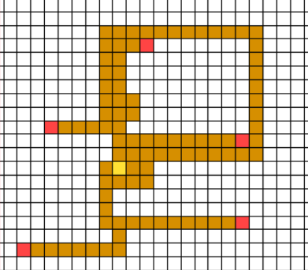

parfois une forme de periodicité (donc output pas très propre)
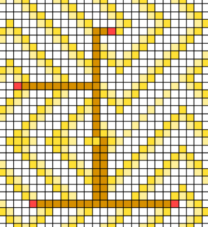

pas tjrs optimal:
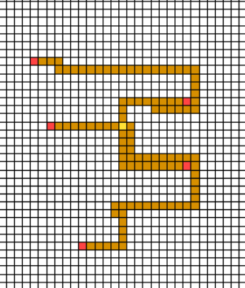

labyrinth time:
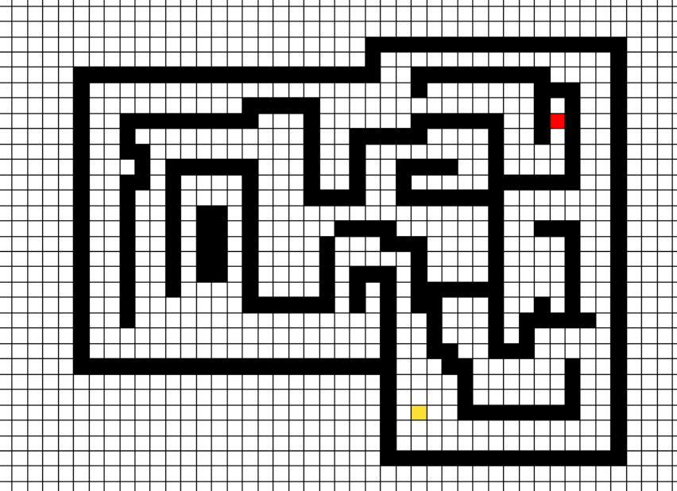
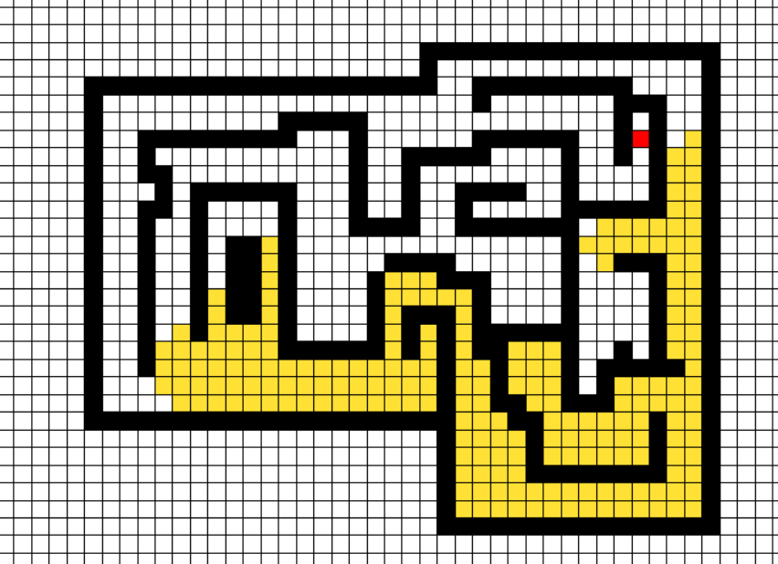
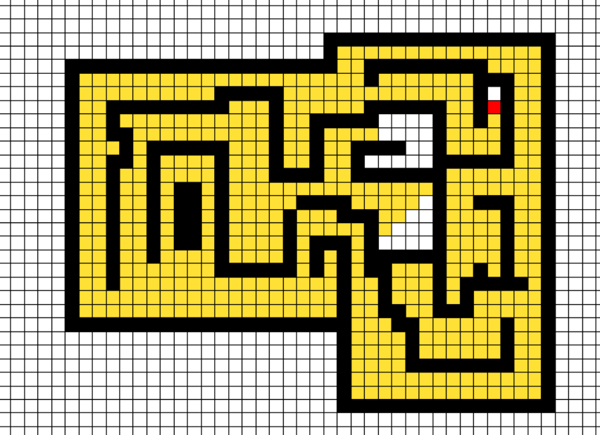
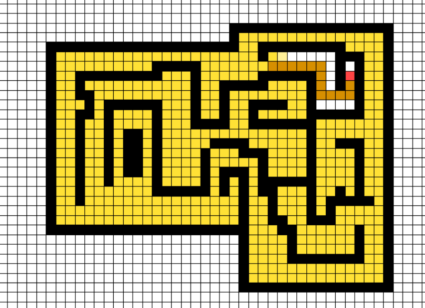
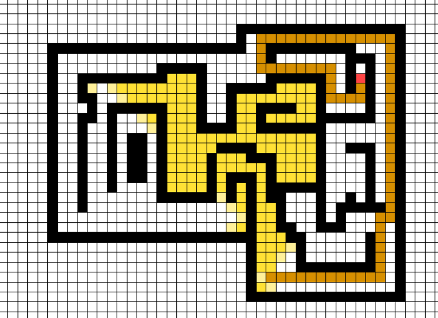
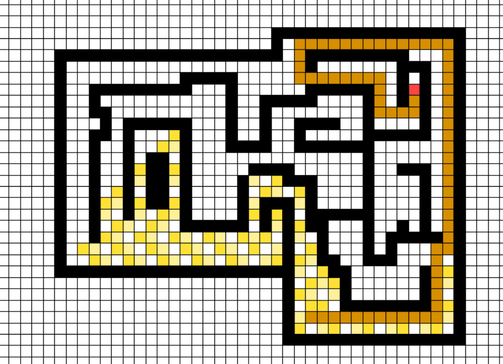

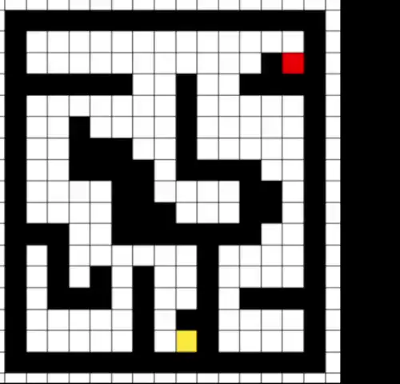

la france (avec Moore):
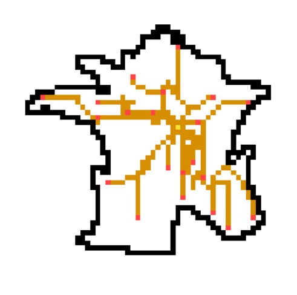

### Formalisation du modèle


Un état $C_{i,j}$ est un couple $(S_{i,j}, D_{i,j})$ où $S_{i,j} \in \{ \text{Blob}, \text{Food}, \text{Path}, \text{RetractingBlob}, \text{FoundFood}, \text{Wall}, \text{Initial} \}$ et $D_{i,j} \in \{-1,0,1\}^2$.
(en réalité certains couples sont non valides, donc il  a ~)

Les règles sont les suivantes. Par prioritaire, on entend le premier voisin dans l'ordre suivant : Ouest, Est, Sud, Nord, NordEst, NordOuest, SudEst, SouthWest

##### Point initial

Si $S_{i,j} = \text{Blob}$ et que $D_{i,j} = (0,0)$, alors $S_{i,j}$ devient Initial.

##### Extension du blob

Si $S_{i,j} = \text{Empty}$, alors il devient $\text{Blob}$ si il existe $(k,l)$ prioritaire dans le voisinage de $(i,j)$ tel que $S_{k,l} = \text{Blob}$. On met alors $D_{i,j}$ à $ (k,l) - (i,j)$. 

##### Retractation
Si $S_{i,j} = \text{RetractingBlob}$, alors il devient $\text{Empty}$.

##### Consommation de nourriture
Si $S_{i,j} = \text{Food}$, alors il devient $\text{FoundFood}$ s'il existe un $(k,l)$ dans le voisinage de $(i,j)$ tel que $S_{k,l} = \text{Blob}$.

---

Les règles qui suivent s'appliquent seulement pour un Blob ayant une direction non nulle (donc différent du point initial).
##### Formation de chemin

Si $S_{i,j} = \text{Blob}$ et qu'il existe $(k,l)$ dans le voisinage de $(i,j)$ tel que $S_{k,l} = \text{Food}$ et que $(i,j)$ soit prioritaire parmi les voisins de $(k,l)$ d'état $\text{Blob}$, alors $S_{i,j}$ devient $\text{Path}$.

petite précision : on peut vérifier que $(i,j)$ est bien prioritaire parmi les voisins de $(k,l)$ en conservant le caractère local (on a simplement étendu le rayon de voisinage de $1$ à $2$).

##### Extension du chemin

Si ((la règle précédente n'a pas été appliquée et que $S_{i,j} = \text{Blob}$) ou ($S_{i,j} = \text{Empty}$)) et qu'il existe $(k,l)$ dans le voisinage de $(i,j)$ tel que $S_{k,l} = \text{Path}$ et que $(i,j)+D_{k,l} = (k,l)$ alors $S_{i,j}$ devient $\text{Path}$.

##### Élagage des chemins inutiles

Si la règle précédente n'a pas été appliquée et que $S_{i,j} = \text{Blob}$, et qu'il existe $(k,l)$ dans le voisinage de $(i,j)$ tel que $S_{k,l} \in \{ \text{Path}, \text{RetractingBlob}\}$, alors $S_{i,j}$ devient $\text{RetractingBlob}$.

Tous les autres gardent le même état.


## Références

- *Physarum Machines: Computers from Slime Mould*, Andrew Adamatzky, 2010 ()
- *Road planning with slime mould: If Physarum built motorways it would route M6/M74 through Newcastle*, Andrew Adamatzky and Jeff Jones, (0912.3967v1)
- *The emergence and dynamical evolution of complex transport networks from simple low-level behaviours*, Jones J (1503.06579)
- *Characteristics of Pattern Formation and Evolution in Approximations of Physarum Transport Networks*, Jeff Jones, 2010
- *Minimal model of a cell connecting amoebic motion and adaptive transport networks*, Gunji et al, 2008
- *An adaptive and robust biological network based on the vacant-particle transportation model*, Gunji et al, 2010
- *From pattern formation to material computation: multi-agent modelling of physarum polycephalum*, Jeff Jones, 2015
- *Advances in Physarum Machines*
